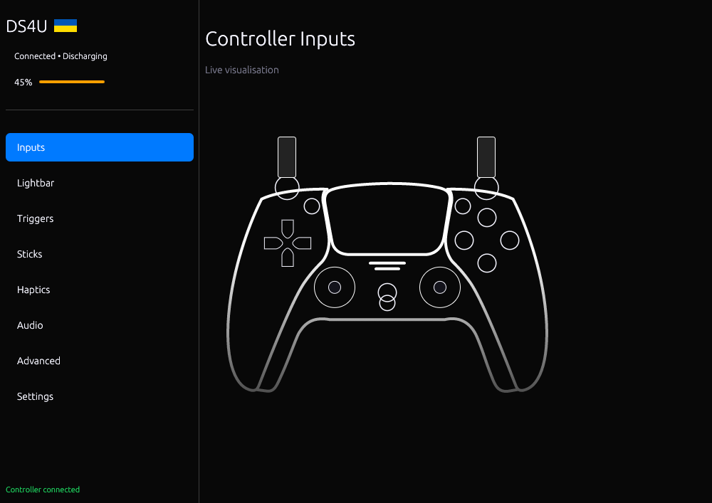

[](https://gitlab.com/deadYokai/ds4u)
[](https://github.com/deadYokai/ds4u)

# DS4U - DualSense for You

Native Linux Gui tool for configuring DualSense controllers.



## Features

### Controller
- Live input preview with real-time button visualization

### Lightbar
- Lightbar color control
- Lightbar effects:
    - **Breath**
    - **Rainbow**
    - **Strobe**

### Audio
- Microphone on/off toggle
- Microphone LED state: `Off`, `On`, `Pulse`

### Firmware update
- Check latest firmware version
- Download and flash firmware

### Themes
- Built-in themes:
    - Default
    - Deep Dark
    - Tokyo Night
- Custom theme support (see [Custom Themes](#custom-themes))

### Daemon
- Background service (see [Daemon](#daemon))
- Controlled by GUI

## Building

### Requirements
- Rust
- `libudev` and `libhidapi` headers

### Build
```sh
git clone https://gitlab.com/deadYokai/ds4u.git
cd ds4u
cargo build --release
```

### Run
```sh
./target/release/ds4u
```

## Daemon

Daemon runs as a background service that maintains connection to controller.

### Starting daemon

```sh
ds4u --daemon
```

Or run as systemd service:

```ini
[Unit]
Description=DS4U DualSense Daemon
After=graphical-session.target

[Service]
ExecStart=/usr/local/bin/ds4u --daemon
Restart=on-failure
RestartSec=3

[Install]
WantedBy=default.target
```

## Custom Themes

Filename must match `id` field inside JSON.

### Theme file format
```json
{
  "id": "tokyo_night",
  "name": "Tokyo Night",
  "dark_mode": true,
  "colors": {
    "window_bg":       [26,  27,  38],
    "panel_bg":        [22,  22,  30],
    "extreme_bg":      [16,  16,  24],
    "accent":          [122, 162, 247],
    "widget_hovered":  [41,  46,  66],
    "widget_inactive": [32,  36,  54],
    "text":            [192, 202, 245],
    "text_dim":        [86,  95,  137],
    "success":         [158, 206, 106],
    "error":           [247, 118, 142],
    "warning":         [224, 175, 104]
  }
}```

All color values are `[R, G, B]` in the 0–255 range.

### Color roles

| Key              | Description                                      |
|------------------|--------------------------------------------------|
| `window_bg`      | Main application background                      |
| `panel_bg`       | Sidebar and panel backgrounds                    |
| `extreme_bg`     | Deepest background (headers, separators)         |
| `accent`         | Highlights, active indicators, selected items    |
| `widget_hovered` | Widget background on hover                       |
| `widget_inactive`| Widget background at rest                        |
| `text`           | Primary text                                     |
| `text_dim`       | Secondary / hint text                            |
| `success`        | Success indicators (e.g. connected, applied)     |
| `error`          | Error indicators                                 |
| `warning`        | Warning indicators                               |

## Config & Data Paths

| Path | Contents |
|------|----------|
| `~/.config/ds4u/settings.json` | Active theme ID and active profile name |
| `~/.config/ds4u/profiles/` | Saved profiles (`<name>.json`) |
| `~/.config/ds4u/themes/` | Custom theme files (`<id>.json`) |
| `$XDG_RUNTIME_DIR/ds4u.socket` | Daemon Unix socket |


## Contributing

See [CONTRIBUTING.md](CONTRIBUTING.md).

## Support links:

- Patreon: https://www.patreon.com/c/MyNameIsKitsune
- Monobank: https://send.monobank.ua/jar/9oVcUiHxPd

> One-time donation currently unavailable. But you can subscribe to Patreon and unsubscribe.
